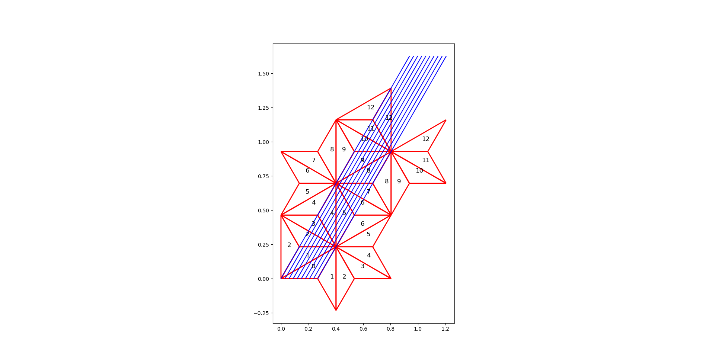

# Billiards Trajectory Simulator

This program simulates and visualizes the trajectory of a billiard ball inside a triangle, using the concept of unfolding the path into a straight line through a series of reflected triangles.

## How to Run

1.  Make sure you have Python 3 and the `matplotlib` and `numpy` libraries installed.
    ```bash
    pip install matplotlib numpy
    ```
2.  Run the program from your terminal:
    ```bash
    python3 main.py
    ```

## How it Works

The program will prompt you to enter the following information:

*   **Two angles of the triangle (in degrees):** Enter two angles of the initial triangle, separated by a comma. The angles must be positive and their sum must be less than 180.
*   **Initial trajectory angle (in degrees):** This is the angle of the billiard ball's path with respect to the base of the triangle.
*   **Number of reflections:** The number of times the path will be reflected.

The program will then generate a plot showing the sequence of reflected triangles. Only the triangles that are crossed by the trajectory path are shown. The number inside each triangle indicates the reflection number.

## Example Output
Using as angles 30, 120. Trajectory angle of 60, and 12 periods.

