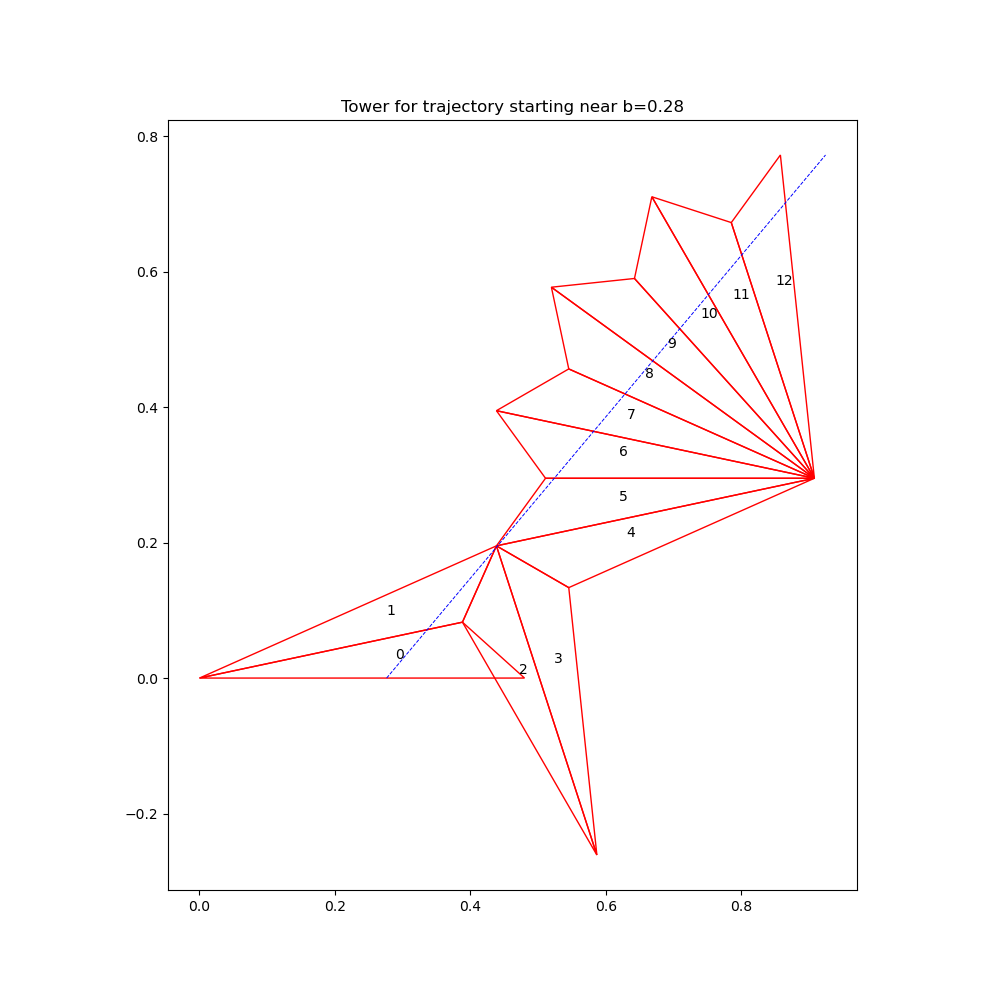

# Billiards Trajectory Simulator

This program simulates and visualizes the trajectory of a billiard ball inside a triangle. It uses the concept of "unfolding" the path by reflecting the triangle across the sides the trajectory hits, which turns the path into a straight line.

## How to Run

1.  Make sure you have Python 3 and the `matplotlib` and `numpy` libraries installed.
    ```bash
    pip install matplotlib numpy
    ```
2.  Run the program from your terminal:
    ```bash
    python3 main.py
    ```

## How it Works

The program first prompts you to enter the triangle angles and trajectory parameters.

It then traces multiple trajectories across the triangle. For each trajectory, it generates the corresponding path of reflected triangles (a "tower"). It has several important features:

- **Path Tracing**: It follows each trajectory step-by-step, reflecting the triangle across the specific edge the path exits, ensuring the tower is built correctly.
- **Degeneracy Detection**: It identifies and discards "degenerate" towers, which are cases where the trajectory passes exactly through a vertex of a reflected triangle.
- **Uniqueness**: It analyzes all the valid, non-degenerate towers and identifies the ones that are structurally unique.

### Output

The program will first print a summary of how many unique, non-degenerate towers it found.

It will then display the plots for each unique tower one by one. You must close a plot window to proceed to the next one.

Additionally, it will save each tower's plot as a PNG file in the project directory (e.g., `tower_1.png`, `tower_2.png`, etc.).

## Example Towers

Below are the 10 unique, non-degenerate towers found for the default case (a 30-120-30 degree triangle with a 60-degree trajectory angle).

*(Note: The number of towers generated will vary depending on the input parameters.)*

| Tower 1 | Tower 2 |
| :---: | :---: |
|  |  |
| **Tower 3** | **Tower 4** |
|  |  |
| **Tower 5** | **Tower 6** |
|  |  |
| **Tower 7** | **Tower 8** |
|  |  |
| **Tower 9** | **Tower 10** |
|  |  |
