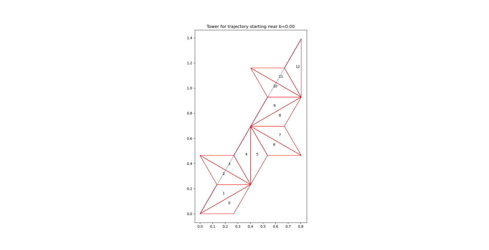

# Billiards Trajectory Simulator

This program simulates and visualizes the trajectory of a billiard ball inside a triangle. It uses the concept of "unfolding" the path by reflecting the triangle across the sides the trajectory hits, which turns the path into a straight line.

## Installation

Make sure you have Python 3 and the `matplotlib` and `numpy` libraries installed.

```bash
pip install matplotlib numpy
```

## Usage

Run the program from your terminal:

```bash
python3 main.py
```

The program will launch an interactive command-line interface (CLI) that will guide you through the required inputs:

1.  **Enter two angles of the triangle...**: Provide two angles in degrees, separated by a comma (e.g., `30, 120`).
2.  **Enter initial trajectory angle...**: Provide the starting angle of the trajectory in degrees (e.g., `50`).
3.  **Enter number of reflections...**: Enter a positive integer for the number of reflections (e.g., `12`).
4.  **Autosave plots...**: Choose whether to save the output plots as PNG files by entering `yes` or `no`.

### The Simulation Process

Once the inputs are provided, the simulator traces multiple trajectories and performs several key functions:

- **Path Tracing**: It follows each trajectory step-by-step, reflecting the triangle across the specific edge the path exits.
- **Degeneracy Detection**: It identifies and discards "degenerate" towers, where the trajectory passes exactly through a vertex.
- **Uniqueness**: It analyzes all valid paths to identify the structurally unique "towers".

### Output

The program will first print a summary of how many unique, non-degenerate towers it found.

It will then display the plots for each unique tower one by one. You must close a plot window to proceed to the next one.

If you enable autosaving, it will also save each tower's plot as a PNG file in the `images/` directory (e.g., `images/tower_1.png`).

## Example Towers

Below are the 10 unique, non-degenerate towers found for a **12-42-126** degree triangle with a **50-degree** trajectory angle.

*(Note: The number of towers generated will vary depending on the input parameters.)*

| Tower 1 | Tower 2 |
| :---: | :---: |
|  |  |
| **Tower 3** | **Tower 4** |
|  |  |
| **Tower 5** | **Tower 6** |
|  |  |
| **Tower 7** | **Tower 8** |
|  |  |
| **Tower 9** | **Tower 10** |
|  |  |

## Additional Example

Here is an additional example for a **30-120-30** degree triangle with a **60-degree** trajectory angle.


